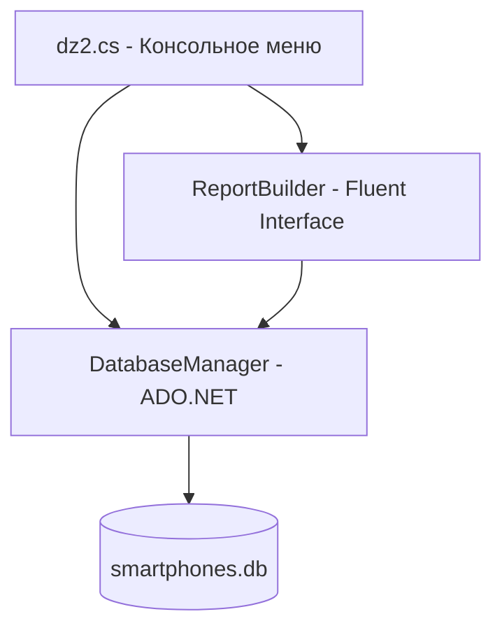

# Проект «Страны и города» — Домашнее задание 2

Проект представляет собой консольное C#-приложение (.NET 8.0/10.0), реализующее функции реляционной СУБД для управления справочником стран и основной таблицей городов с показателями численности населения.

Вся работа с базой данных SQLite реализована на базе **прямого взаимодействия через ADO.NET** (`Microsoft.Data.Sqlite`) с ручным написанием SQL-запросов и параметризацией.

Отличительной особенностью проекта является построение форматированных текстовых отчетов на базе паттерна **Fluent Interface (текучий интерфейс)**.

---

## 🛠️ Технологический стек

* **Язык**: C# 12 / .NET 8.0/10.0
* **База данных**: SQLite
* **Доступ к данным**: ADO.NET (`Microsoft.Data.Sqlite`) с поддержкой целостности внешних ключей (`PRAGMA foreign_keys = ON`)
* **Шаблоны проектирования**: Fluent Interface (в генераторе отчетов `ReportBuilder`)
* **Интерфейс пользователя**: Интерактивное консольное меню (CLI)
* **Формат обмена**: Экспорт и импорт таблиц в формате CSV (разделитель `;`).

---

## 📐 Архитектура системы



### 1. Модель данных
- **`Manufacturer`**: Справочник брендов-производителей (сторона "один"). Поля: `Id` (PK), `Name`.
    
- **`Smartphone`**: Основная таблица устройств (сторона "много"). Поля: `Id` (PK), `ManufacturerId` (FK), `Name`, `Price`.
    
    - Валидация: В свойстве `Price` реализована проверка `value < 0`, выбрасывающая исключение `ArgumentException` («Критическая ошибка: Стоимость не может быть меньше нуля!»).

### 2. Слой доступа к данным (`DatabaseManager.cs`)
- Выполняет `CREATE TABLE` для таблиц `manufacturer` и `smartphone` при инициализации базы данных.
    
- Реализует CRUD-операции на базе параметризованных команд (`SqliteCommand`) для гарантированной защиты от SQL-инъекций.
    
- Автоматически наполняет базу данных начальным демонстрационным набором популярных брендов (Apple, Samsung, Xiaomi, Huawei) и моделей при первом создании файла БД.

### 3. Текучий интерфейс отчетов (`ReportBuilder.cs`)
Паттерн **Fluent Interface** позволяет конструировать сложные текстовые отчеты динамически в виде цепочки легкочитаемых вызовов:
```csharp
new ReportBuilder(db)
    .Query("SELECT ...")
    .Title("Заголовок отчета")
    .Header("Колонка 1", "Колонка 2")
    .ColumnWidths(25, 20)
    .Footer("Всего записей")
    .Print();
```
**Возможности `ReportBuilder`**:

- Табличное форматирование строк с автоматическим выравниванием по ширине колонок с помощью метода `PadRight`.
- Динамическое чтение структуры схемы данных (`FieldCount`, `GetName`, `GetValue`) напрямую из `SqliteDataReader`.
- Автоматический подсчет строк выборки и вывод кастомного итогового подвала (`.Footer()`) в конце таблицы.

---

## 🖥️ Консольное меню (Интерфейс)

Интерактивное меню CLI предоставляет полный доступ ко всем функциям системы:

1. **Вывести справочник производителей**: Вывод списка зарегистрированных брендов.
    
2. **Показать полный список смартфонов**: Отображение всех доступных на складе позиций.
    
3. **Внести новый смартфон в базу**: Интерактивное добавление устройства с указанием ID бренда, названия модели и розничной цены.
    
4. **Модифицировать (изменить) параметры смартфона**: Корректировка имени или стоимости выбранного по ID телефона с проверкой на пустой ввод.
    
5. **Безвозвратно удалить смартфон**: Ликвидация записи о товаре из базы данных по его первичному ключу.
    
6. **Перейти в блок аналитических Отчётов**: Отдельное подменю со следующими аналитическими выборками:
    
    - _Отчет 1_: Полный прайс-лист смартфонов со связыванием таблиц через оператор `JOIN` (сортировка по алфавиту).
        
    - _Отчет 2_: Объем модельного ряда по брендам (`GROUP BY` и `COUNT(*)`).
        
    - _Отчет 3_: Расчет средней стоимости устройств для каждого бренда (`GROUP BY` и математическая агрегация `AVG`).

---

## 🚀 Инструкция по сборке и запуску

Приложение кроссплатформенно и собирается стандартными средствами .NET SDK.

### 1. Подключение необходимых зависимостей

Для работы приложения требуется пакет SQLite, который можно установить через встроенный терминал внутри папки проекта:

Bash

```
dotnet add package Microsoft.Data.Sqlite
```

### 2. Сборка и запуск приложения

Запустите проект из корневой папки `дз2`:

Bash

```
dotnet run
```

## 📂 Структура файлов проекта

Вся логика приложения умышленно сгруппирована в рамках одного файла для упрощения развертывания:

- `dz2.cs` — Единый исходный файл, содержащий:
    
    - Классы-модели данных (`Smartphone`, `Manufacturer`).
        
    - Компонент доступа к данным (`DatabaseManager`).
        
    - Компонент построения отчетов (`ReportBuilder`).
        
    - Точку входа `Main` с логикой CLI-меню.
        
- `ElectronicsStore.csproj` — Файл конфигурации проекта и сборки .NET.